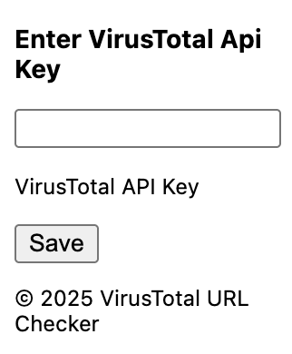
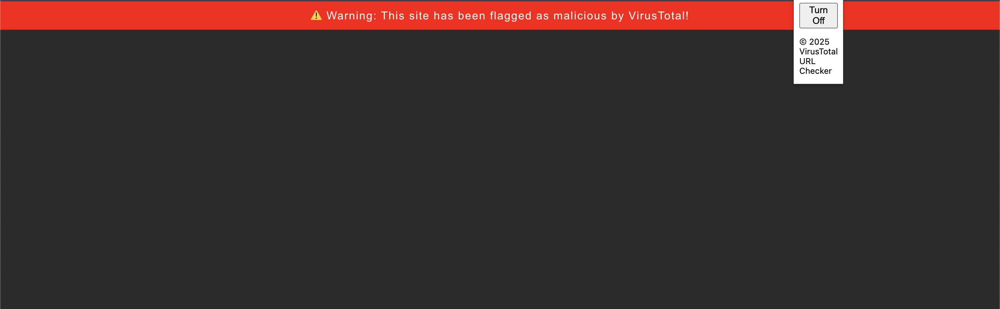

# VT Guard Checker - Browser Extension

**VT Guard Checker** is a browser extension that checks websites using [VirusTotal](https://www.virustotal.com/) API and alerts you if the URL is flagged as malicious.

## 🌐 Features

- Real-time URL scanning via VirusTotal API
- Visual warning page for unsafe websites
- Easy-to-use interface for entering your VirusTotal API key
- No user data is collected or stored

## 📸 Screenshots

### Entering Your API Key

When the extension is first installed, you will be prompted to enter your VirusTotal API key.

### Warning Page

If the site is marked as malicious by VirusTotal, a warning screen will appear.

---

## 🛠️ How to Install Locally

Follow these steps to load the extension locally into your browser:

### Step 1: Download the Extension Files

Clone or download the repository to your computer:

https://github.com/mrkzqsmv/VT-Guard
